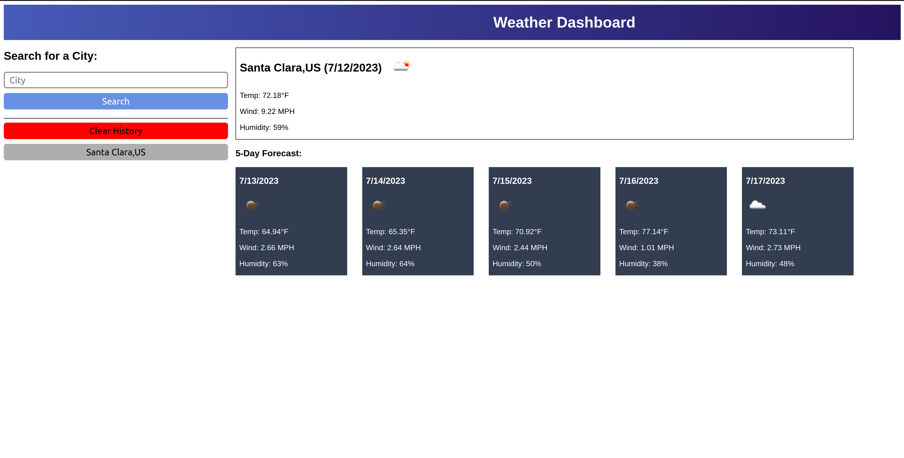

# Weather Dashboard

## Description
This weather dashboard app allows you to get up to date weather information for cities worldwide. Once you search for a city it will give you the current weather of that city and a 5 day weather forecast.

Upon searching for a city the app displays the temperature, wind speed, humidity, and an icon representing the weather condition.

## Usage
Just type in your city name and click Search. The app will automatically get the weather.

You can click the Clear History button in order to clear your search history.

You can check out the website through this [link](https://ryansheehy0.github.io/Weather_Dashboard/).

## Source Code
The source code can be found within the folder docs.
